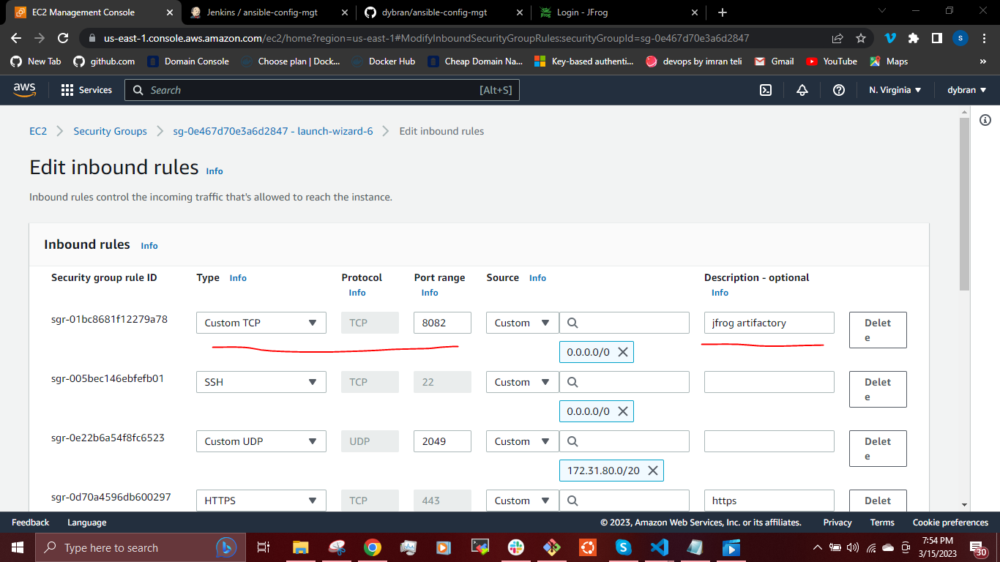
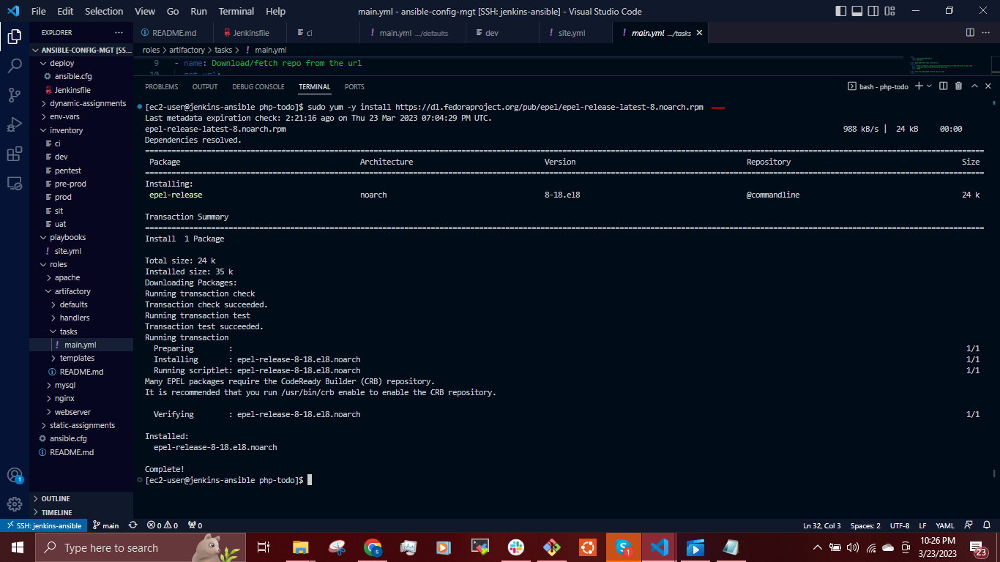
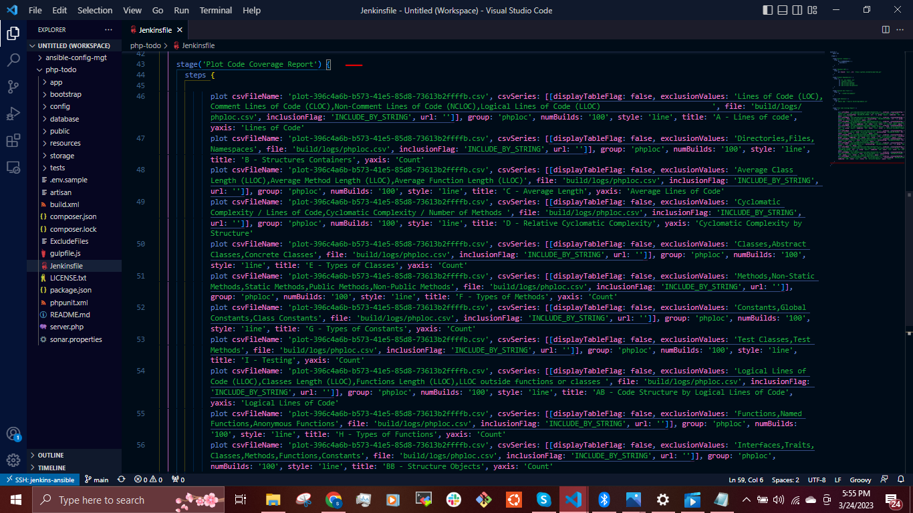
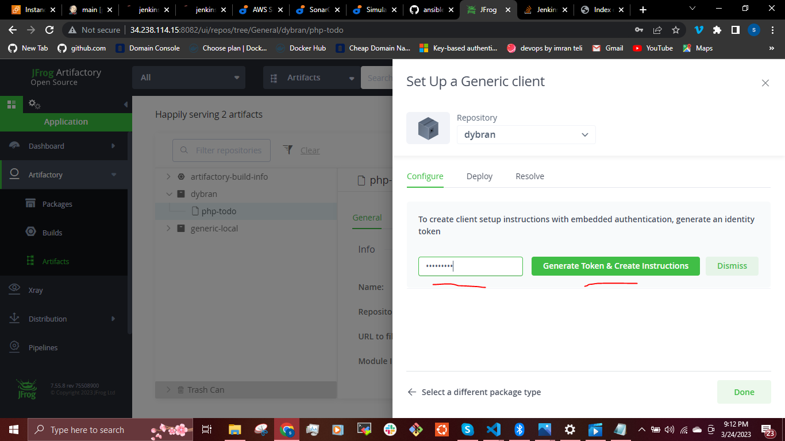
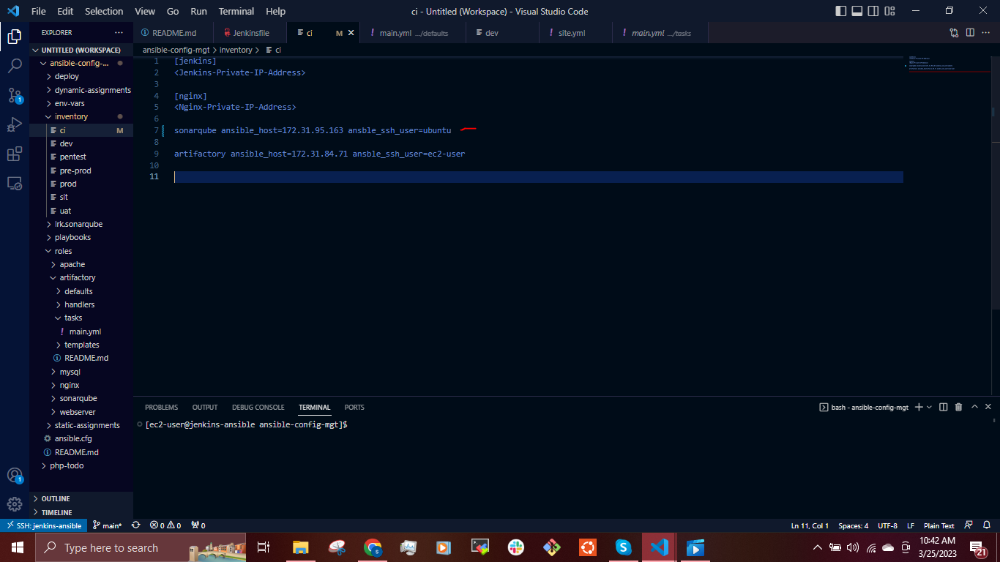
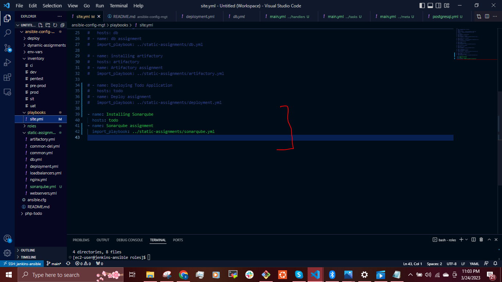
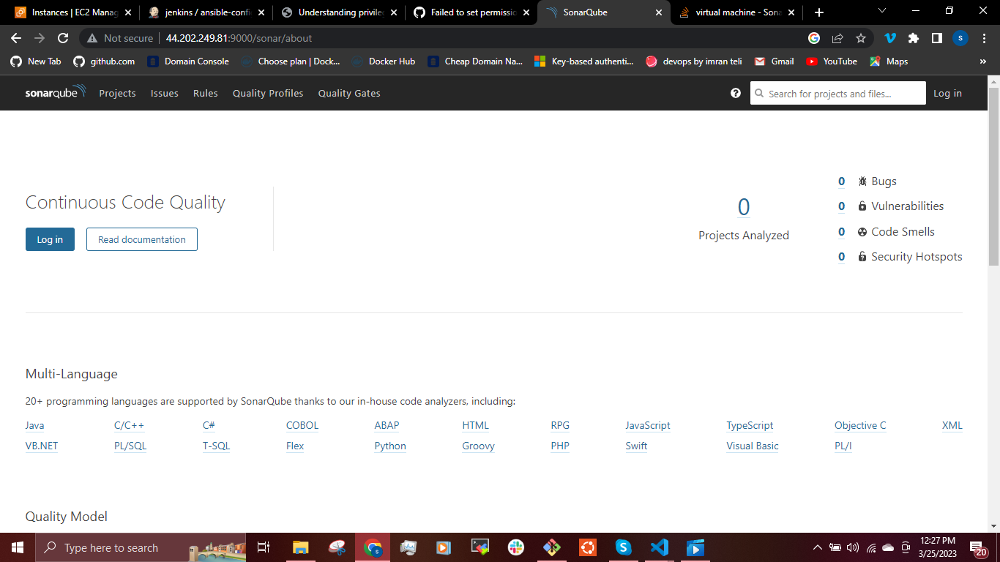

## __CONTINUOUS INTEGRATION WITH JENKINS | ANSIBLE | ARTIFACTORY | SONARQUBE | PHP__ ##

To emphasize a typical CI Pipeline further, let us explore the diagram below a little deeper.


- __Version Control:__ This is the stage where developers’ code gets committed and pushed after they have tested their work locally.
- __Build:__ Depending on the type of language or technology used, we may need to build the codes into binary executable files (in case of compiled languages) or just package the codes together with all necessary dependencies into a deployable package (in case of interpreted languages).
- __Unit Test:__ Unit tests that have been developed by the developers are tested. Depending on how the CI job is configured, the entire pipeline may fail if part of the tests fails, and developers will have to fix this failure before starting the pipeline again. A Job by the way, is a phase in the pipeline. Unit Test is a phase, therefore it can be considered a job on its own.
- __Deploy:__ Once the tests are passed, the next phase is to deploy the compiled or packaged code into an artifact repository. This is where all the various versions of code including the latest will be stored. The CI tool will have to pick up the code from this location to proceed with the remaining parts of the pipeline.
- __Auto Test:__ Apart from Unit testing, there are many other kinds of tests that are required to analyse the quality of code and determine how vulnerable the software will be to external or internal attacks. These tests must be automated, and there can be multiple environments created to fulfil different test requirements. For example, a server dedicated for Integration Testing will have the code deployed there to conduct integration tests. Once that passes, there can be other sub-layers in the testing phase in which the code will be deployed to, so as to conduct further tests. Such are User Acceptance Testing (UAT), and another can be Penetration Testing. These servers will be named according to what they have been designed to do in those environments. A UAT server is generally be used for UAT, SIT server is for Systems Integration Testing, PEN Server is for Penetration Testing and they can be named whatever the naming style or convention in which the team is used. An environment does not necessarily have to reside on one single server. In most cases it might be a stack as you have defined in your Ansible Inventory. All the servers in the inventory/dev are considered as Dev Environment. The same goes for inventory/stage (Staging Environment) inventory/preprod (Pre-production environment), inventory/prod (Production environment), etc. So, it is all down to naming convention as agreed and used company or team wide.
- __Deploy to production:__ Once all the tests have been conducted and either the release manager or whoever has the authority to authorize the release to the production server is happy, he gives green light to hit the deploy button to ship the release to production environment. This is an Ideal Continuous Delivery Pipeline. If the entire pipeline was automated and no human is required to manually give the Go decision, then this would be considered as Continuous Deployment. Because the cycle will be repeated, and every time there is a code commit and push, it causes the pipeline to trigger, and the loop continues over and over again.
- __Measure and Validate:__ This is where live users are interacting with the application and feedback is being collected for further improvements and bug fixes. 

In this project, I will be setting up a CI/CD Pipeline for a __PHP__ based application. The overall CI/CD process looks like the architecture below.


This project is architected in two major repositories with each repository containing its own CI/CD pipeline written in a Jenkinsfile

- __ansible-config-mgt__ Repository: This repository employs the use of Jenkinsfile to configure infrastructure required to carry out processes for our application to run using ansible roles.

- __PHP-todo__ Repository: This repository uses Jenkinsfile to run the processes needed to build the PHP application. These processes include testing, building, packaging and deploy.
  
For this project, i will be using __RHEL 8 and ubuntu 20.04 instances__. The tools we will be using to build, test, run code analysis, package and deploy our PHP application are Github, jenkins, Sonarqube and jfrog artifactory.

__CONFIGURING THE JENKINS SERVER FOR DEPLOYMENT__

First, we start our Jenkins instance.


Connect to our vscode


Rename the Server

`$ sudo vi /etc/hostname`

Then add the name __jenkins-ansible__

`$ sudo hostname jenkins-ansible`


Disconnect and re-connect


To setup our jenkins and clone the __ansible-config-mgt__ repository from our github, i created a file 

`$ sudo vi jenkins-install.sh`


then added the bash script below
```
#!/bin/bash

echo "#### Install git ####"
sudo yum install git -y

echo "#### Cloning Git-Repo ####"
git clone https://github.com/dybran/ansible-config-mgt.git

echo "#### Install wget and unzip -y ####"
sudo yum install wget unzip -y

echo "#### Download Repo from URL ####"
sudo wget -O /etc/yum.repos.d/jenkins.repo \
    https://pkg.jenkins.io/redhat-stable/jenkins.repo
sudo rpm --import https://pkg.jenkins.io/redhat-stable/jenkins.io.key

echo "#### Upgrading Repo ####"
sudo yum upgrade -y

echo "#### Installing Java 11 and Jenkins ####"
sudo yum install java-11-openjdk -y
sudo yum install jenkins -y

echo "#### Reload Deamon ####"
sudo systemctl daemon-reload

echo "#### Start and Enable Jenkins ####"
sudo systemctl start jenkins
sudo systemctl enable jenkins
```


Then we make the script executable by running the command

`$ sudo chmod +x jenkins-install.sh`

and run the script

`$ ./jenkins-install.sh`


We check the version installed and status of the jenkins server using the command

`$ jenkins --version`

`$ sudo systemctl status jenkins`


Then using the jenkins URL, we can access the jenkins UI

`<jenkins-IP-address>:8080>`


Install __Open Blue Ocean Plugin__ on jenkins


Create a new pipeline


Select github


Connect jenkins with Github  and Login to GitHub & Generate an Access
token


Generate access token, Copy Access Token and paste in the space provided to connect to github.

Then select the __ansible-config-mgt__ repository and click on __create pipeline__.


At this point we do not have a __Jenkinsfile__ in the __ansible-config-mgt__ repository.

Click on "__Administration__" to exit the Blue Ocean console.

Here is our newly created pipeline. It takes the name of your GitHub repository


Inside the __ansible-config-mgt__, create a new directory __deploy__ and start a new __Jenkinsfile__ inside the directory.

Add the code snippet below to start building the Jenkinsfile gradually. This pipeline currently has just one stage called __Build__ and the only thing we are doing is using the shell script module to echo Building Stage.

```
pipeline {
    agent any

  stages {
    stage('Build') {
      steps {
        script {
          sh 'echo "Building Stage"'
        }
      }
    }
    }
}
```


Go into the __ansible-config_mgt__ in the jenkins UI, and click on "__configure__" to configure the jenkins.


Click on __Build Configuration__ and edit the __script path__


Back to the pipeline again and click "__Build now__"

This will trigger a build and you will be able to see the effect of our basic Jenkinsfile configuration by going through the console output of the build.


Blue ocean


This pipeline has multibranchs. This means, if there were more than one branch in GitHub, Jenkins would have scanned the repository to discover them all and we would have been able to trigger a build for each branch.

To see this in action, we will create a new git branch and name it __feature/jenkinspipeline-stages__

`$ git checkout -b feature/jenkinspipeline-stages`

Currently we only have the Build stage. Let us add other stages. Paste the code snippet below. 

```
pipeline {
    agent any

  stages {

    stage('initial cleanup') {
      steps {
       dir("${WORKSPACE}") {
	    deleteDir()

	   }
      }
    }
    stage('Build') {
      steps {
        script {
          sh 'echo "Building Stage"'
        }
      }
    }

    stage('Test') {
      steps {
        script {
          sh 'echo "Testing Stage"'
        }
      }
    }
    
   stage('packaging') {
      steps {
        script {
          sh 'echo "Packaging Stage"'
        }
      }
    }

   stage('Deploy') {
      steps {
        script {
          sh 'echo "Deploying Stage"'
        }
      }
    }

  stage('Deploy') {
      steps {
        script {
          sh 'echo "Deploying Stage"'
        }
      }
    }
  stage('Clean Up') {
      steps {
        cleanWs()
      }
    }
  }
}
```


Push the new changes to GitHub.

`$ git status`

`$ git add .`

`$ git commit -m "<commit-message>"`

`$  git push origin feature/jenkinspipeline-stages`


To make your new branch show up in Jenkins, we need to tell Jenkins to scan the repository.


Click on the __ansible-config-mgt__ job and then click on __"Administration"__ button to go back to the jenkins UI.

__RUNNING ANSIBLE PLAYBOOK FROM JENKINS__

Now that we have a broad overview of a typical Jenkins pipeline. Let us get the actual Ansible deployment to work.

We will be setting up __database__ and __nginx__ on two different instances using ansible playbook on jenkins UI.


To install Ansible on Jenkins, We also need to install __python3__ as it is a dependency for ansible to be able to successfully run a database role.

`$ sudo yum install ansible -y`


Search for the __Python3__ for mysql

`$ sudo yum search python3 | grep -i mysql`

then install

`$ sudo yum install python3-pyMYSQL.noarch -y`


Installing Ansible plugin in Jenkins UI


Then go to __"global tool configuration"__ under __"manage jenkins"__ to set up ansible plugin to work with jenkins


Creating Jenkinsfile to run the ansible playbook on jenkins.

Jenkins needs to export the ANSIBLE_CONFIG environment variable. You can put the __ansible.cfg__ file alongside Jenkinsfile in the deploy directory. This way, anyone can easily identify that everything in there relates to deployment.

We need to set the credentials for ansible to be able to work with  jenkins smoothly. To do this we go to __manage credentials__ under __manage jenkins__.


We copy the content of our private key into the section __"key"__.


Using the Pipeline Syntax tool in Ansible, generate the syntax to create environment variables to set.


```
pipeline {

   agent any

   environment {
    ANSIBLE_CONFIG='${WORKSPACE}/deploy/ansible.cfg'
   }

   stages {

    stage('Initial Clean Up') {
      steps {
        dir('${WORKSPACE}') {
         deleteDir()
        }

      }
    }


    stage('Checkout SCM') {
      steps {
        git branch: 'feature/jenkinspipeline-stages', url: 'https://github.com/dybran/ansible-config-mgt.git'
      }
    }

    stage('Setting Roles Path in the Ansible.cfg File') {

      steps {
        sh 'echo ${WORKSPACE}'
        sh 'sed -i "3 a roles_path=${WORKSPACE}/roles" ${WORKSPACE}/deploy/ansible.cfg'
      }
    }

    stage('Run Ansible Playbook') {

      steps {
        ansiblePlaybook colorized: true, credentialsId: 'private-key', disableHostKeyChecking: true, installation: 'ansible', inventory: 'inventory/dev', playbook: 'playbooks/site.yml'

      }
    }

    stage('Clean Up') {
      steps {
         cleanWs(cleanWhenAborted: true, cleanWhenNotBuilt: true, cleanWhenUnstable: true, cleanWhenFailure: true)
      }

    }
     
   }
}
```

Then in the__inventory/dev__ file, we update the IP address for our __database__ and __nginx__.

```
nginx ansible_host=<Private-IP-address> ansible_ssh_user=<ec2-user>
db ansible_host=<Private-IP-address> ansible_ssh_user=<ubuntu>
```


We set up roles for the database and nginx. The database roles will create a database - __tooling__ and a database user - __webaccess__. We will go ahead and edit the __defaults/main.yml_ file in the mysql role.


We can refer to [Project-12](https://github.com/dybran/Project-12/blob/main/project-12.md) on how to set up these roles.

The __playbooks/site.yml__


We push to github and then click on __"scan repository now"__ the __ansible-config-mgt__ on the jenikins UI. The __ansible-config_mgt__ repository is scanned for any branch that has a Jenkinsfile and then builds.


__PARAMETERIZING 'Jenkinsfile' FOR ANSIBLE DEPLOYMENT__

To deploy to other environments, we will need to use parameters.

Update Jenkinsfile to introduce parameterization. Below is just one parameter. It has a default value in case if no value is specified at execution. It also has a description so that everyone is aware of its purpose.

```
pipeline {
    agent any

    parameters {
      string(name: 'inventory', defaultValue: 'dev',  description: 'This is the inventory file for the environment to deploy configuration')
    }
```


In the Ansible execution section, remove the hardcoded inventory/dev and replace with __'${inventory}'__


From now on, each time you hit on __"build now"__ it will expect an input. The default value is __dev__ as specified in the parameter.


__INSTALLING ARTIFACTORY__

Create an instance as target for the artifactory to be installed.

Create artifactory role


Update the __tasks/main.yml__ with the code snippet to install artifactory to the server.

```
---
# tasks file for artifactory

- name: install java 11
  yum:
    name: java-11-openjdk-devel
    state: present

- name: Download/fetch repo from the url
  get_url:
    url:  https://releases.jfrog.io/artifactory/artifactory-rpms/artifactory-rpms.repo 
    dest: /home/ec2-user/jfrog-artifactory-rpms.repo
    mode: '0755'
 
- name: Copy the downloaded file to the etc repo
  copy:
    src: /home/ec2-user/jfrog-artifactory-rpms.repo
    dest: /etc/yum.repos.d/jfrog-artifactory-rpms.repo
    remote_src: yes
    follow: yes

- name: update cache
  yum:
    update_cache: yes

- name: install artifactory
  yum:
    name: jfrog-artifactory-oss
    state: present

- name: start and enable artifactory
  service:
    name: artifactory
    state: started
    enabled: yes
```


Artifactory IP address in the __inventory/ci__


Install __plot plugin__ and __artifactory plugin__. We will use __plot plugin__ to display tests reports and code coverage information while the __Artifactory plugin__ will be used to easily upload code artifacts into an Artifactory server.

Installing plot plugin


Install artifactory plugin


Push to the github and trigger the __ansible_config_mgt__ job using __'build with parameters'__.


Make sure to edit the inbound rules



This installs the artifactory.


We can now use our IP address to access the artifactory


Setup the artifactory and create a repo named __dybran__


In Jenkins UI configure Artifactory to work with jenkins


Our __feature/jenkinspipeline-stages__ branch can be merged to the __main__ branch if we are satistfied with the codes.

### __CI/CD PIPELINE FOR TODO APPLICATION__ ###

We already have tooling website as a part of deployment through Ansible. Here we will introduce another __PHP application__ to add to the list of software products we are managing in our infrastructure.This particular application is an ideal application to show an end-to-end CI/CD pipeline.

Our goal here is to deploy the application onto servers directly from Artifactory rather than from github.

Clone the __PHP-Todo__ repository from github

`$ git clone https://github.com/darey-devops/php-todo.git`


On you Jenkins server, install PHP and its dependencies

`$ sudo yum install https://dl.fedoraproject.org/pub/epel/epel-release-latest-8.noarch.rpm -y`

`$ sudo yum install https://rpms.remirepo.net/enterprise/remi-release-8.rpm -y`

`$ sudo dnf install dnf-utils -y`

`$ sudo dnf module reset php -y`

`$ sudo dnf module install php:remi-7.4`

`$ sudo dnf update -y`

`$ sudo yum install wget php-{pear,cgi,common,curl,mbstring,gd,mysqlnd,gettext,bcmath,json,xml,fpm,intl,zip,imap}`

`$ php -v`




Install __composer__

`$ curl -sS https://get.composer.org/installer | php`

`$ sudo mv composer.phar /usr/bin/composer`


__Integrate Artifactory repository with Jenkins__

Create a __Jenkinsfile__ in the __PHP-Todo__ repository.

Using Blue Ocean, create a multibranch Jenkins pipeline.

On the database server, create database and user __ansible-config-mgt__ and create a database for the __PHP-Todo__.

Configure the __defaults/main.yml__ in the __mysql__ roles to add a database - __'homestead'__ and user - __'homestead'__.

Replace the user's host with the jenkins private IP address.


Push and run using __build with parameters__ on __inventory/dev__


To conifirm that __homestead__ database was created, log into the instance and run the command 

`$ sudo mysql`

`mysql> show databases;`


Install mysql client on the jenkins server so the jenkins can remotely log in to the database

`$ sudo yum install mysql -y`


`$ sudo vi /etc/mysql/mysql.conf.d/mysqld.cnf`

Set `bind-address=0.0.0.0`


Update the database connectivity requirements in the file __.env.sample_.

```
DB_HOST=172.31.85.92
DB_DATABASE=homestead
DB_USERNAME=homestead
DB_PASSWORD=sePret^i
DB_CONNECTION=mysql
DB_PORT=3306
```

Go into the __PHP-Todo__

`$ cd PHP-Todo`

Update Jenkinsfile in the __PHP-Todo__ with the following

```
pipeline {
    agent any

  stages {

     stage("Initial cleanup") {
          steps {
            dir("${WORKSPACE}") {
              deleteDir()
            }
          }
        }

    stage('Checkout SCM') {
      steps {
            git branch: 'main', url: 'https://github.com/darey-devops/php-todo.git'
      }
    }

    stage('Prepare Dependencies') {
      steps {
             sh 'mv .env.sample .env'
             sh 'composer install'
             sh 'php artisan migrate'
             sh 'php artisan db:seed'
             sh 'php artisan key:generate'
      }
    }
  }
}
```
Push to github and build.


In the __Prepare Dependencies__ section, the required file by PHP is __.env__ so we are renaming __.env.sample__ to __.env__.

Composer is used by PHP to install all the dependent libraries used by the application.
__php artisan__ uses the __.env__ file to setup the required database objects.

After successful run of this step, login to the database, run show tables and you will see the tables being created.

`$ mysql -h <database-IP-address> -u homestead -p`


__N/B:__ 
- Be sure to edit __inbound rules__ for __jenkins__ and __database__ servers


To conifirm that __homestead__ database was created, log into the instance and run the command 

`$ sudo mysql`

`mysql> show databases;`

`mysql> homestead;`

`mysql> show tables;`


Update the Jenkinsfile to include Unit tests step

```
 stage('Execute Unit Tests') {
      steps {
             sh './vendor/bin/phpunit'
      }
``` 


__Code Quality Analysis__

For PHP the most commonly tool used for code quality analysis is __phploc__. 

The data produced by __phploc__ can be ploted onto graphs in Jenkins.

Add the code analysis step in Jenkinsfile. The output of the data will be saved in __build/logs/phploc.csv file.__

Install __phploc__

`$ sudo dnf --enablerepo=remi install php-phpunit-phploc`

`$ wget -O phpunit https://phar.phpunit.de/phpunit-7.phar`

`$ sudo chmod +x phphunit`


```
stage('Code Analysis') {
  steps {
        sh 'phploc app/ --log-csv build/logs/phploc.csv'

  }
}
```


Plot the data using plot Jenkins plugin.

This plugin provides generic plotting (or graphing) capabilities in Jenkins. It will plot one or more single values variations across builds in one or more plots. Plots for a particular job (or project) are configured in the job configuration screen, where each field has additional help information. Each plot can have one or more lines (called data series). After each build completes the plots’ data series latest values are pulled from the CSV file generated by phploc.

```
 stage('Plot Code Coverage Report') {
      steps {

            plot csvFileName: 'plot-396c4a6b-b573-41e5-85d8-73613b2ffffb.csv', csvSeries: [[displayTableFlag: false, exclusionValues: 'Lines of Code (LOC),Comment Lines of Code (CLOC),Non-Comment Lines of Code (NCLOC),Logical Lines of Code (LLOC)                          ', file: 'build/logs/phploc.csv', inclusionFlag: 'INCLUDE_BY_STRING', url: '']], group: 'phploc', numBuilds: '100', style: 'line', title: 'A - Lines of code', yaxis: 'Lines of Code'
            plot csvFileName: 'plot-396c4a6b-b573-41e5-85d8-73613b2ffffb.csv', csvSeries: [[displayTableFlag: false, exclusionValues: 'Directories,Files,Namespaces', file: 'build/logs/phploc.csv', inclusionFlag: 'INCLUDE_BY_STRING', url: '']], group: 'phploc', numBuilds: '100', style: 'line', title: 'B - Structures Containers', yaxis: 'Count'
            plot csvFileName: 'plot-396c4a6b-b573-41e5-85d8-73613b2ffffb.csv', csvSeries: [[displayTableFlag: false, exclusionValues: 'Average Class Length (LLOC),Average Method Length (LLOC),Average Function Length (LLOC)', file: 'build/logs/phploc.csv', inclusionFlag: 'INCLUDE_BY_STRING', url: '']], group: 'phploc', numBuilds: '100', style: 'line', title: 'C - Average Length', yaxis: 'Average Lines of Code'
            plot csvFileName: 'plot-396c4a6b-b573-41e5-85d8-73613b2ffffb.csv', csvSeries: [[displayTableFlag: false, exclusionValues: 'Cyclomatic Complexity / Lines of Code,Cyclomatic Complexity / Number of Methods ', file: 'build/logs/phploc.csv', inclusionFlag: 'INCLUDE_BY_STRING', url: '']], group: 'phploc', numBuilds: '100', style: 'line', title: 'D - Relative Cyclomatic Complexity', yaxis: 'Cyclomatic Complexity by Structure'      
            plot csvFileName: 'plot-396c4a6b-b573-41e5-85d8-73613b2ffffb.csv', csvSeries: [[displayTableFlag: false, exclusionValues: 'Classes,Abstract Classes,Concrete Classes', file: 'build/logs/phploc.csv', inclusionFlag: 'INCLUDE_BY_STRING', url: '']], group: 'phploc', numBuilds: '100', style: 'line', title: 'E - Types of Classes', yaxis: 'Count'
            plot csvFileName: 'plot-396c4a6b-b573-41e5-85d8-73613b2ffffb.csv', csvSeries: [[displayTableFlag: false, exclusionValues: 'Methods,Non-Static Methods,Static Methods,Public Methods,Non-Public Methods', file: 'build/logs/phploc.csv', inclusionFlag: 'INCLUDE_BY_STRING', url: '']], group: 'phploc', numBuilds: '100', style: 'line', title: 'F - Types of Methods', yaxis: 'Count'
            plot csvFileName: 'plot-396c4a6b-b573-41e5-85d8-73613b2ffffb.csv', csvSeries: [[displayTableFlag: false, exclusionValues: 'Constants,Global Constants,Class Constants', file: 'build/logs/phploc.csv', inclusionFlag: 'INCLUDE_BY_STRING', url: '']], group: 'phploc', numBuilds: '100', style: 'line', title: 'G - Types of Constants', yaxis: 'Count'
            plot csvFileName: 'plot-396c4a6b-b573-41e5-85d8-73613b2ffffb.csv', csvSeries: [[displayTableFlag: false, exclusionValues: 'Test Classes,Test Methods', file: 'build/logs/phploc.csv', inclusionFlag: 'INCLUDE_BY_STRING', url: '']], group: 'phploc', numBuilds: '100', style: 'line', title: 'I - Testing', yaxis: 'Count'
            plot csvFileName: 'plot-396c4a6b-b573-41e5-85d8-73613b2ffffb.csv', csvSeries: [[displayTableFlag: false, exclusionValues: 'Logical Lines of Code (LLOC),Classes Length (LLOC),Functions Length (LLOC),LLOC outside functions or classes ', file: 'build/logs/phploc.csv', inclusionFlag: 'INCLUDE_BY_STRING', url: '']], group: 'phploc', numBuilds: '100', style: 'line', title: 'AB - Code Structure by Logical Lines of Code', yaxis: 'Logical Lines of Code'
            plot csvFileName: 'plot-396c4a6b-b573-41e5-85d8-73613b2ffffb.csv', csvSeries: [[displayTableFlag: false, exclusionValues: 'Functions,Named Functions,Anonymous Functions', file: 'build/logs/phploc.csv', inclusionFlag: 'INCLUDE_BY_STRING', url: '']], group: 'phploc', numBuilds: '100', style: 'line', title: 'H - Types of Functions', yaxis: 'Count'
            plot csvFileName: 'plot-396c4a6b-b573-41e5-85d8-73613b2ffffb.csv', csvSeries: [[displayTableFlag: false, exclusionValues: 'Interfaces,Traits,Classes,Methods,Functions,Constants', file: 'build/logs/phploc.csv', inclusionFlag: 'INCLUDE_BY_STRING', url: '']], group: 'phploc', numBuilds: '100', style: 'line', title: 'BB - Structure Objects', yaxis: 'Count'

      }
    }
```


Push and build


You should now see a Plot menu item on the left menu. Click on it to see the charts.


Bundle the application code into the artifact (archived package) to be uploaded to Artifactory.

```
stage ('Package Artifact') {
    steps {
            sh 'zip -qr php-todo.zip ${WORKSPACE}/*'
     }
    }
```


Publish the resulted artifact into Artifactory.

```
stage ('Upload Artifact to Artifactory') {
          steps {
            script { 
                 def server = Artifactory.server 'artifactory'                 
                 def uploadSpec = """{
                    "files": [
                      {
                       "pattern": "php-todo.zip",
                       "target": "<name-of-artifact-repository>/php-todo",
                       "props": "type=zip;status=ready"

                       }
                    ]
                 }""" 

                 server.upload spec: uploadSpec
            }
          }

}
```


Push to github and build


Check the artifactory for the deployed artifact


Deploy the application to the dev environment by launching Ansible pipeline

```
stage ('Deploy to Dev Environment') {
    steps {
    build job: 'ansible-project/main', parameters: [[$class: 'StringParameterValue', name: 'env', value: 'dev']], propagate: false, wait: true
    }
  }
```


The build job used in this step tells Jenkins to start another job. In this case it is the ansible-project job, and we are targeting the main branch. Hence, we have ansible-project/main. Since the Ansible project requires parameters to be passed in, we have included this by specifying the parameters section. The name of the parameter is env and its value is dev. Meaning, deploy to the Development environment.

So we will create an instance for the __TODO__ server and put the IP address in __inventory/dev__


write an ansible script for deployment to the server in the __ansible-config-mgt__.


An encrypted password from artifactory for the ansible script to be able to access artifactory and deploy the artifactory to the server.

To create an encrypted password from our artifactory





Copy the encrypted password and place in the ansible script above.

Push the changes in both the __PHP-Todo__ and __ansible-config-mgt__ to github respectively.

When we run the Jenkinsfile in the __PHP-Todo__ repository, it automatically triggers the Jenkinsfile in the __ansible-config-mgt__ repository.

build in the __PHP-Todo__


Triggers the Jenkinsfile in the __ansible-config-mgt__


The build job used in this step tells Jenkins to start another job. In this case it is the __ansible-config-mgt__ job, and we are targeting the __main branch__ hence, we have __ansible-config/main__. Since the Ansible project requires parameters to be passed in, we have included this by specifying the parameters section. The name of the parameter is __env__ and its value is __dev__. Meaning, deploy to the Development environment.

Even though we have implemented Unit Tests and Code Coverage Analysis with phpunit and phploc, we still need to implement Quality Gate to ensure that ONLY code with the required code coverage, and other quality standards make it through to the environments.

To achieve this, we need to configure __SonarQube__ – An open-source platform developed by SonarSource for continuous inspection of code quality to perform automatic reviews with static analysis of code to detect bugs, code smells, and security vulnerabilities.

__SONARQUBE INSTALLATION__

SonarQube is a tool that can be used to create quality gates for software projects, and the ultimate goal is to be able to ship only quality software code.

To install sonarqube

First, create an instance and then set up roles that will automate the installation of sonarqube.
This role works with a __Postgresql__ database.


Create a __sonarqube.yml__ file in the __static-assignments__ directory.


Update the __inventory/ci__



Update the __playbooks?sites.yml__



Push to Github and __build with parameters__.


Access the sonarqube from the browser using the instance IP address.




Install __sonarscanner plugin__ on the Jenkins UI


Open __sysytem configurations__ on the jenkins UI


Generate authentication token in SonarQube


Configure Quality Gate Jenkins Webhook in SonarQube – The URL should point to your Jenkins server


We use the token to set up the webhook.

Setup SonarQube scanner from Jenkins – Global Tool Configuration


Update the __PHP-Todo__ Jenkinsfile with sonarqube scanner and quality gate stage. This stage should  come befor the __packaging stage__.

```
stage('SonarQube Quality Gate') {
        environment {
            scannerHome = tool 'SonarQubeScanner'
        }
        steps {
            withSonarQubeEnv('sonarqube') {
                sh "${scannerHome}/bin/sonar-scanner"
            }

        }
    }
```


Push to github and run the build.


This but fail but it will enable us access the __/var/lib/jenkins/tools/hudson.plugins.sonar.SonarRunnerInstallation/SonarQubeScanner/conf/__ directory where we will nedd to find the __sonar-scanner.properties__.

Open __sonar-scanner.properties__ file

`$ sudo vi cd /var/lib/jenkins/tools/hudson.plugins.sonar.SonarRunnerInstallation/SonarQubeScanner/conf/sonar-scanner.properties`

Add configuration related to __PHP-Todo__ project

```
sonar.host.url=http://<SonarQube-Server-IP-address>:9000
sonar.projectKey=php-todo
#----- Default source code encoding
sonar.sourceEncoding=UTF-8
sonar.php.exclusions=**/vendor/**
sonar.php.coverage.reportPaths=build/logs/clover.xml
sonar.php.tests.reportPath=build/logs/junit.xml
```


Install  [Access Control List - ACL package](https://linuxhint.com/access-control-lists-ubuntu/) for the for postgresdb permissions if the job fails to run.


To know what exactly was put inside the __sonar-scanner.properties__ file, SonarQube has a configurations page where you can get some directions.

The end to end pipeline overview


The quality gate we just included has no effect because on the SonarQube UI, you will realise that we just pushed a poor-quality code onto the development environment.


There are bugs, and there is 0.0% code coverage. (code coverage is a percentage of unit tests added by developers to test functions and objects in the code).

If you click on php-todo project for further analysis, you will see that there is 6 hours worth of technical debt, code smells and security issues in the code.


In the development environment, this is acceptable as developers will need to keep iterating over their code towards perfection. But as a DevOps engineer working on the pipeline, we must ensure that the quality gate step causes the pipeline to fail if the conditions for quality are not met.

Assuming we want to run __quality gate__ only on __develop, hotfix, release or main__ to deploy code to Integration environment. we use the __when__ condition.

`when { branch pattern: "^develop*|^hotfix*|^release*|^main*", comparator: "REGEXP"}`

Then we add a timeout step to wait for SonarQube to complete analysis and successfully finish the pipeline only when code quality is acceptable.

```
timeout(time: 1, unit: 'MINUTES') {
        waitForQualityGate abortPipeline: true
    }
```
The complete stage will now look like this:

```
    stage('SonarQube Quality Gate') {
      when { branch pattern: "^develop*|^hotfix*|^release*|^main*", comparator: "REGEXP"}
        environment {
            scannerHome = tool 'SonarQubeScanner'
        }
        steps {
            withSonarQubeEnv('sonarqube') {
                sh "${scannerHome}/bin/sonar-scanner -Dproject.settings=sonar-project.properties"
            }
            timeout(time: 1, unit: 'MINUTES') {
                waitForQualityGate abortPipeline: true
            }
        }
    }
```


 You will realise that only branches other than __develop, hotfix, release or main__ will be able to deploy the code.

The blue ocean display looks like this:


The current state of the code cannot be deployed to Integration environments due to its quality. The developers will be notified to work on the code further based on SonarQube quality report. 
Once everything is good with code quality, the pipeline will pass codes further to a higher environment.

__JENKINS-SLAVE__

We can setup Jenkins-slave and configure Jenkins to run its pipeline jobs randomly on any available slave nodes.

First, we create the Jenkins-slave instances


Install java 11 on the instances


We can also configure the jobs to build automatically using a webhook.
Refer to [Project-11](https://github.com/dybran/Project-11/blob/main/project-11.md) on how to set up webhook on Github.

__N/B:__
- Make sure to edit all inbound rules on the various servers.


